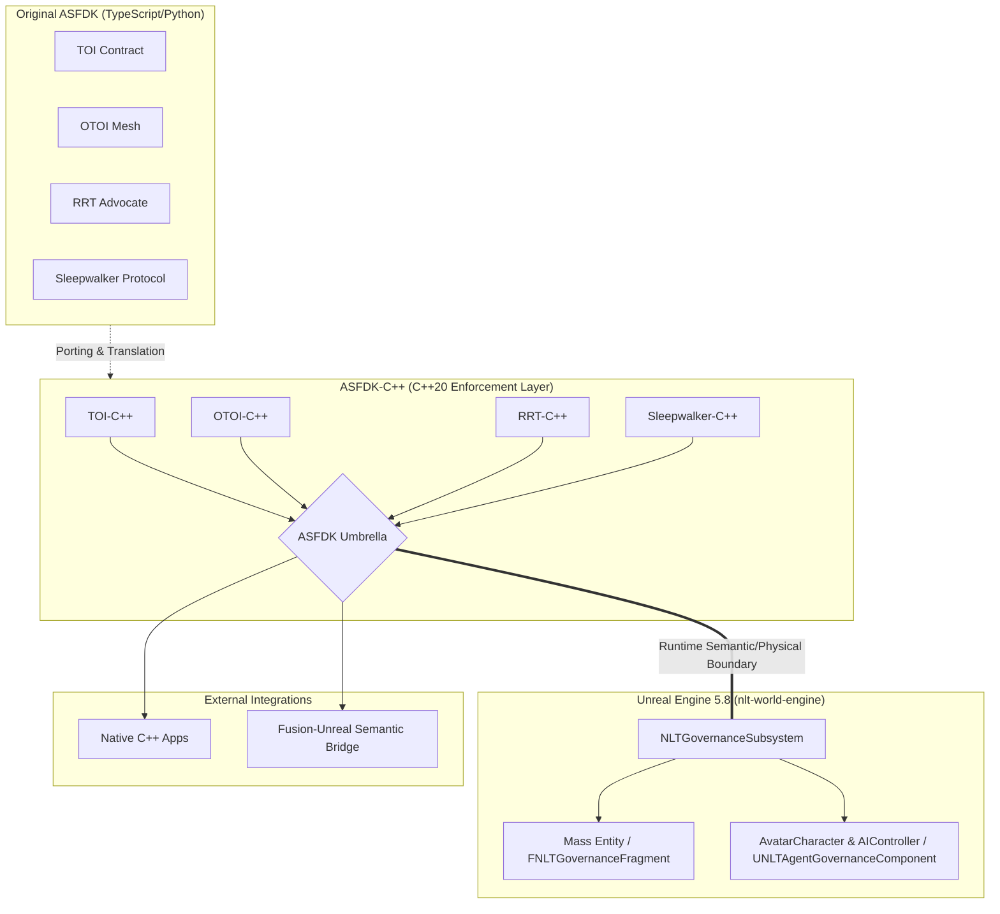

# ASFDK C/C++ Governance

**ASFDK Solidarity Framework port to C/C++** — providing TOI/OTOI/ASFDK compliance for C/C++ ecosystems, including Unreal Engine C++ and native C++ application integration.

## Repository Overview

This is the C/C++ port of the NeuroLift Technologies ASFDK (Solidarity Framework Development Kit), enabling governance-aware AI systems in the C and C++ ecosystems.

**Document ID:** ORG-DEV-OTOI-1.0.3  
**Governed by:** Solidarity Framework | HAIEF  
**Related repositories:**
- `NeuroLift-Technologies/asfdk` — Original ASFDK (Python/TypeScript)
- `NeuroLift-Technologies/asfdk-kotlin` — Kotlin port
- `NeuroLift-Technologies/asfdk-csharp` — C#/.NET port
- `NeuroLift-Technologies/asfdk-harness` — ASFDK harness/runtime

## Architecture




## Structure

```
asfdk-cplus/
├── AGENTS.md                  # Agent registry (2 agents: governance + Unreal bridge)
├── CLAUDE.md                  # Agent session directives
├── NLT-DEV-OTOI.md            # Org-level governance contract
├── nltotoi.json               # Discovery manifest
├── templates/                 # OTOI Section 3 formats
│   ├── agent-registration.json
│   ├── handoff-record.json
│   ├── escalation.md
│   └── intent-log.md
├── ISSUE_TEMPLATE/            # GitHub issue forms
├── PULL_REQUEST_TEMPLATE/     # PR checklist
├── SOPs/                      # Standard operating procedures
├── .github/workflows/         # CI governance validation
│   └── validate-governance.yml
└── .nltotoi/                  # Namespace structure
    ├── README.md
    ├── index/
    │   └── governance-files.md
    ├── agent-registration.json
    └── scripts/
        └── validate-governance.sh
```

## Quick Start

```bash
# Validate governance compliance
bash .nltotoi/scripts/validate-governance.sh

# All 22 checks pass when properly configured
```

## Agent Registration

All agents must self-register per OTOI Section 3. Store registration in `docs/agent-log/registrations/` or log to the active thread record.

See `templates/agent-registration.json` for the registration format.

## Governance Validation

Run the validation script to verify all governance files are present and valid:

```bash
bash .nltotoi/scripts/validate-governance.sh
```

Expected output: `✅ Governance validation PASSED — all 22 checks OK`

## Integration Targets

**NLTGovernanceSubsystem Integration:**
- Unreal Engine C++ governance subsystem
- Native C++ application boundaries
- Fusion ↔ Unreal semantic/physical reality bridge
- Mass Entity governance compliance

## Related Projects

- **asfdk** — Original ASFDK (Python/TypeScript)
- **asfdk-kotlin** — Kotlin port
- **asfdk-csharp** — C#/.NET port (sister repo)
- **asfdk-cplus** — This repo: C/C++ port
- **asfdk-harness** — ASFDK runtime/control plane

## License

Internal use only — NeuroLift Technologies organization.# asfdk-cplus
